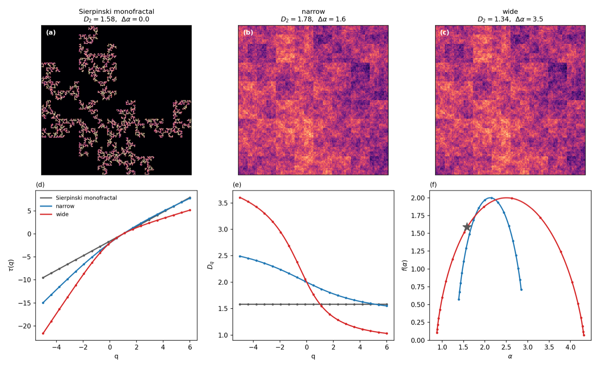

# Multiplicative Cascade

A Python package for generating and analyzing multifractal fields using multiplicative cascade processes.

<p align="center">
  
</p>

> **Three conservative cascades of increasing singularity width** — a Sierpinski monofractal, a *narrow* multifractal, and a *wide* one — sharing a single random-permutation skeleton *(top, a–c)*. Their exact multifractal spectrum — the mass exponent τ(q), generalized dimensions D(q) and singularity spectrum f(α) — is recovered directly from the fields to machine precision *(bottom, d–f)*: the monofractal's spectrum collapses to a single point, while the multifractal f(α) parabolas widen with the tunable non-Gaussianity dial Δα. Both the **generation** and the **analysis** use only the few functions documented below.

## Overview

This package implements multifractal analysis tools based on multiplicative cascades, as described in [Wikipedia: Multiplicative cascade](https://en.wikipedia.org/wiki/Multiplicative_cascade). It provides functions for:

- Generating multifractal density fields
- Measuring fractal dimensions using box-counting methods
- Creating mock particle distributions from density fields

## Installation

Clone the repository and install dependencies:

```bash
git clone https://github.com/csabiu/multiplicative_cascade.git
cd multiplicative_cascade
pip install numpy scipy
```

## Main Functions

### `multifrac(probabilities, dim=2, size=2, levels=4, add_power=False)`

Generate a multiplicative cascade fractal field.

**Parameters:**
- `probabilities`: Probability weights for the cascade (auto-normalized to sum to 1, with a warning, so mass is conserved)
- `dim`: Dimensionality (1, 2, or 3)
- `size`: Subdivision factor / cascade base `b` at each level (default: 2)
- `levels`: Number of cascade levels (default: 4)
- `add_power`: Apply increasing power weights at each level — breaks mass conservation, slope is only a rough estimate (default: False)
- `seed` / `rng`: Reproducible random permutations without touching global state. With neither, the legacy global `np.random` state is used. (default: None)
- `verbose`: Print the theoretical `D₂` (default: False)
- `plot`: Convenience plotting, delegated to `plot_field` (default: False)

**Returns:**
- `cascade_field`: The generated multifractal field
- `theoretical_slope`: The theoretical correlation dimension `D₂ = -log_b(Σᵢ pᵢ²)`

**Example:**
```python
import numpy as np
from multifrac import multifrac

# Create a 2D multifractal field
weights = np.array([0.1, 0.2, 0.3, 0.4])
field, theory_dim = multifrac(weights, dim=2, size=2, levels=5)
print(f"Field shape: {field.shape}")
print(f"Theoretical dimension: {theory_dim:.4f}")
```

### `fractal_dimension(field, threshold=None, method='binary', q=2, ...)`

Measure the fractal dimension of a 2D or 3D field using box-counting methods.

**Parameters:**
- `field`: Input field (2D or 3D array)
- `threshold`: Threshold for binary method (default: median of non-zero values)
- `method`: 'binary' (threshold-based) or 'mass' (intensity-based)
- `q`: Order of generalized dimension for mass method (default: 2)
- `weights`: Optional spatial weight array
- `mask`: Optional boolean mask for observed regions
- `min_observed_fraction`: Minimum observed fraction for a box (default: 0.5)
- `min_box_size`: Minimum box size in pixels (default: 2)
- `max_box_size`: Maximum box size (default: half of smallest dimension)
- `num_scales`: Number of box sizes to test (default: 10)
- `return_diagnostics`: Return detailed fit information (default: False)

**Returns:**
- `dimension`: Estimated fractal dimension
- `diagnostics`: (optional) Dictionary with fit details

**Methods:**
1. **Binary box-counting** (`method='binary'`): Counts boxes where mean > threshold
2. **Mass-based** (`method='mass'`): Accounts for field intensity using partition functions

**Example:**
```python
from multifrac import fractal_dimension

# Binary box-counting (default)
dim_binary = fractal_dimension(field)

# Mass-based method
dim_mass = fractal_dimension(field, method='mass', q=2)

# With spatial weighting
weights = np.exp(-field)
dim_weighted = fractal_dimension(field, weights=weights)

# With mask for incomplete observations
mask = (observations > 0)  # True where data exists
dim_masked = fractal_dimension(field, mask=mask, min_observed_fraction=0.3)
```

### `mock(density, boxsize=100, Npart=100)`

Generate mock particle distributions from a density field using Poisson sampling.

**Parameters:**
- `density`: Input density field (2D or 3D)
- `boxsize`: Physical size of the simulation box (default: 100)
- `Npart`: Target number of particles (default: 100)

**Returns:**
- `points`: Particle positions sampled from density field
- `randoms`: Uniform random positions (10× Npart)

**Example:**
```python
from multifrac import mock

# Generate particles from density field (seed= for reproducibility)
particles, randoms = mock(field, boxsize=100, Npart=1000, seed=0)
print(f"Generated {particles.shape[0]} particles")
```

### `cascade_spectrum(weights, base=2, q=None)`

Exact **closed-form** multifractal spectrum of a conservative cascade — its
distinguishing feature. Returns a dict with arrays `tau`, `D` (= D_q), `alpha`,
`f` over `q`, plus scalars `D0` (capacity), `D1` (information), `D2`
(correlation) and `delta_alpha` = log_b(p_max/p_min), the spectrum width (0 for a
monofractal). Zero weights are handled, so e.g. the Sierpinski multiset
`[1/3, 1/3, 1/3, 0]` works.

```python
from multifrac import cascade_spectrum

s = cascade_spectrum([0.4, 0.3, 0.2, 0.1], base=2)
print(s['D2'], s['delta_alpha'])        # 1.737, 2.0
```

### `generalized_dimensions(field, q=None, base=2)`

**Measured** counterpart of `cascade_spectrum`: estimates the whole `D_q`,
`tau(q)`, `alpha(q)`, `f(q)` spectrum from a single field in one call using the
Chhabra–Jensen direct method (no unstable numerical Legendre transform). Works
for 2D and 3D fields.

```python
from multifrac import multifrac, cascade_spectrum, generalized_dimensions

field, _ = multifrac([0.4, 0.3, 0.2, 0.1], dim=2, levels=9, seed=1)
measured = generalized_dimensions(field, base=2)   # measured D_q ...
theory   = cascade_spectrum([0.4, 0.3, 0.2, 0.1])  # ... vs exact closed form
```

### `plot_field(field, cmap='viridis', ...)`

Visualize a 1D/2D/3D field. matplotlib is imported lazily here, so importing
`multifrac` and generating fields never requires matplotlib unless you plot.

## Theory

### Multiplicative Cascade

A multiplicative cascade creates a multifractal by recursively subdividing space and multiplying by random probability weights. For a conservative cascade of base `b` (= `size`), the **entire** multifractal spectrum is known in closed form:

```
τ(q) = -log_b(Σᵢ pᵢ^q),    D_q = τ(q)/(q-1),    f(α) = qα - τ(q)
```

so the correlation dimension is

```
D₂ = -log_b(Σᵢ pᵢ²),    b = size
```

where pᵢ are the normalized weights. **Note:** the logarithm is in base `b` (= `size`); it is *not* a hardcoded base 2 — the two coincide only for `size = 2`. Use `cascade_spectrum(weights, base)` for the full spectrum.

### Box-Counting Methods

1. **Binary method**: Counts occupied boxes at different scales
   - N(ε) ~ ε^(-D)

2. **Mass method**: Uses partition functions
   - Σᵢ mᵢ^q ~ ε^((q-1)D_q)
   - D_q is the generalized dimension of order q

Common q values:
- q=0: Capacity dimension
- q=1: Information dimension
- q=2: Correlation dimension (recommended)

## Examples

See the test scripts for detailed examples:
- `test_fractal_dimension.py`: Basic 2D/3D fractal dimension measurement
- `test_mass_dimension.py`: Comparison of binary vs mass-based methods
- `test_unified_dimension.py`: Advanced features (weights, masking)

Run tests:
```bash
python test_fractal_dimension.py
python test_mass_dimension.py
python test_unified_dimension.py
```

## Features

- **Multi-dimensional**: Supports 1D, 2D, and 3D fields
- **Flexible analysis**: Binary and mass-based box-counting methods
- **Spatial weighting**: Emphasize specific regions in the analysis
- **Masking support**: Handle incomplete observations with automatic corrections
- **Generalized dimensions**: Compute D_q for different orders q
- **Diagnostic output**: Detailed fit quality metrics and parameters

## References

- [Multiplicative cascade - Wikipedia](https://en.wikipedia.org/wiki/Multiplicative_cascade)
- Box-counting dimension for multifractal analysis
- Generalized dimensions and partition functions

## License

See LICENSE file for details.
